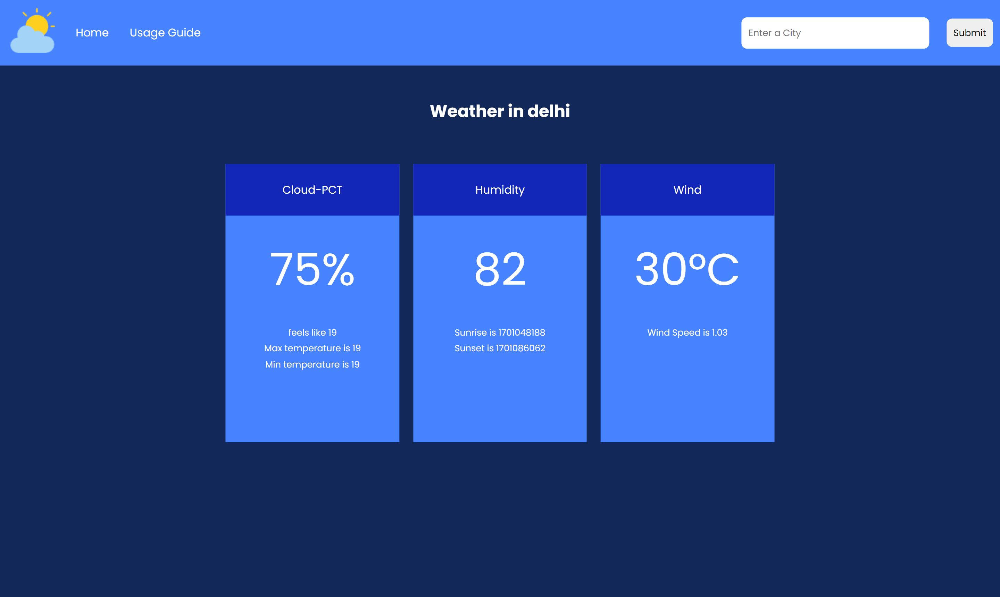

# Weather Application 

This application uses the Weather API to show the real-time weather of different cities around the world.

The Rapid Api used in this application is [here](https://rapidapi.com/apininjas/api/weather-by-api-ninjas/)

You can visit the deployed site [here](https://sauravsatpute.github.io/Calculator-App/)

## Tech Stack

**Client:** HTML, CSS, Javascript, JQuery

## Screenshots

